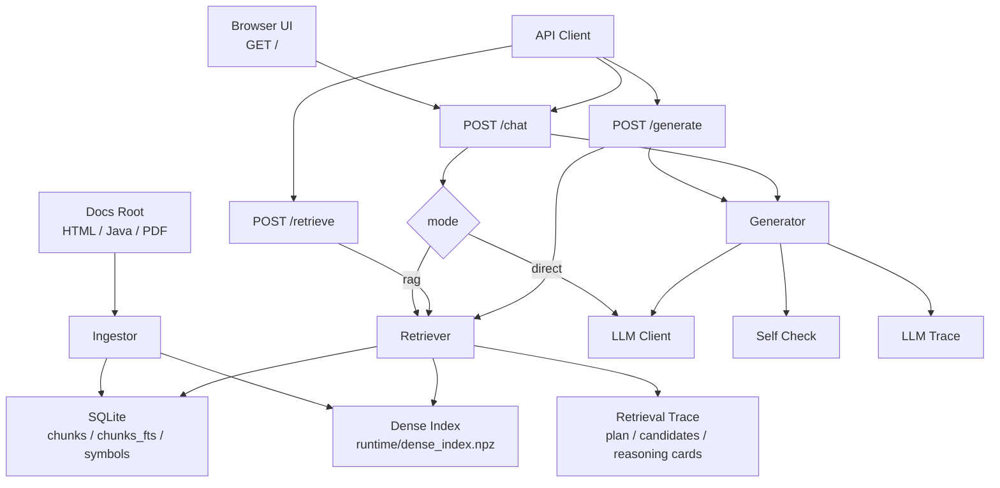

# RAGLocal 架构文档

这份文档描述当前仓库已经落地的完整架构，而不是早期设想版。

## 1. 系统目标

系统解决的问题是：

- 把本地插件 API 文档、示例代码、可选 PDF 指南导入为可检索知识库
- 用 RAG 帮助回答插件开发问题
- 在需要时允许完全跳过 RAG，直接把当前消息转发给大模型

## 2. 整体架构

## 3. 模块划分

### 3.1 API 层

文件：
- `src/rag_codegen/app.py`

职责：
- 暴露 FastAPI 路由
- 组装 `Storage`、`Ingestor`、`Retriever`、`Generator`
- 在 `POST /chat` 中根据 `mode` 分流：
  - `rag`
  - `direct`

### 3.2 导入层

文件：
- `src/rag_codegen/ingest.py`

职责：
- 扫描输入目录
- 解析 `.html`、`.java`、可选 `.pdf`
- 提取 chunk 和 symbol
- 重建 SQLite FTS 与 dense index

输入：
- `doc_root`
- `rebuild`
- `enable_pdf`

输出：
- `runtime/raglocal.db`
- `runtime/dense_index.npz`

### 3.3 存储层

文件：
- `src/rag_codegen/storage.py`

职责：
- 管理 chunks、FTS、symbols
- 提供关键词检索、symbol 查询、基础统计

核心数据：
- `chunks`
- `chunks_fts`
- `symbols`

### 3.4 检索层

文件：
- `src/rag_codegen/retrieve.py`

职责：
- 判断或接收 `plugin_type`
- 构造 staged retrieval plan
- 做 API-first 检索
- 扩展相关类、方法、父类、二跳关系
- 输出 evidence cards 与 reasoning cards

关键结果：
- `plan`
- `stage_candidates`
- `expanded_candidates`
- `second_hop_candidates`
- `selected_titles`
- `reasoning_cards`

### 3.5 生成层

文件：
- `src/rag_codegen/generate.py`

职责：
- `generate(...)`
  标准 RAG 生成流程
- `direct_chat(...)`
  跳过检索，直接把当前输入发给 LLM
- 自检代码块里的符号和关键方法
- 在 RAG 模式下必要时做一次修订

### 3.6 LLM 适配层

文件：
- `src/rag_codegen/llm.py`

职责：
- 调用 OpenAI-compatible `chat/completions`
- 返回文本和 usage

启用条件：
- `LLM_BASE_URL`
- `LLM_API_KEY`
- `LLM_MODEL`

### 3.7 Web UI

文件：
- `src/rag_codegen/webui.py`

职责：
- 提供单页聊天界面
- 支持 `RAG / Direct` 模式切换
- 展示：
  - 自然语言答案
  - 代码块
  - reasoning cards
  - retrieval trace
  - llm trace

## 4. 两种聊天模式

### 4.1 RAG 模式

流程：
1. 当前问题进入 `Retriever.retrieve(...)`
2. 根据 query plan 分阶段检索
3. 把证据、分析、reasoning cards 组织进 prompt
4. 调用 LLM 或本地 mock
5. 执行 self-check
6. 返回答案和 trace

特点：
- 以本地证据为主
- 更适合插件 API 问答和代码生成
- 能看到检索链路

### 4.2 Direct 模式

流程：
1. 当前问题直接进入 `Generator.direct_chat(...)`
2. 不做本地检索
3. 只发送当前用户输入给 LLM
4. 返回模型原始回答和 LLM trace

特点：
- 更像普通聊天
- 不受当前本地知识库限制
- 没有来源卡片和 retrieval trace

## 5. 当前“上下文记忆”状态

当前只有前端页面内聊天记录，没有后端持久会话记忆。

这意味着：
- 页面里能看到多轮历史
- 但每次 `POST /chat` 仍是单轮处理
- `direct` 模式也只转发“当前这一条输入”

如果以后要做真正记忆，需要新增：
- `conversation_id`
- 消息存储
- 历史压缩或摘要
- token budget 控制

## 6. 当前观测能力

### 6.1 Retrieval Trace

RAG 模式会暴露：
- query plan
- 分阶段候选
- 最终选中证据
- reasoning cards

### 6.2 LLM Trace

RAG 和 Direct 都会暴露：
- `request_messages`
- `request_payload`
- `response_text`
- `usage`
- `fallback_reason`

### 6.3 Used Remote LLM

接口会明确返回：
- `used_remote_llm=true`
- 或 `used_remote_llm=false`

这样你可以分辨：
- 本轮是否真的打到了外部模型
- 还是走了本地 fallback

## 7. `reasoning cards` 的研究背景

这里也做一个准确说明：

- `reasoning cards` 是本项目的工程术语
- 它不是直接照搬某篇论文里的标准模块名
- 它背后的设计，主要来自“显式中间推理 + 检索驱动推理 + 后验验证”这三条研究线

对应参考：

1. [Chain-of-Thought Prompting Elicits Reasoning in Large Language Models](https://arxiv.org/abs/2201.11903)
   支撑“显式展开中间步骤有助于复杂推理”。

2. [Show Your Work: Scratchpads for Intermediate Computation with Language Models](https://arxiv.org/abs/2112.00114)
   支撑“保留中间工作区/scratchpad 有助于多步任务”。

3. [Measuring and Narrowing the Compositionality Gap in Language Models](https://arxiv.org/abs/2210.03350)
   其中的 `self-ask` 支撑“先拆 follow-up questions 再逐步求解”。

4. [ReAct: Synergizing Reasoning and Acting in Language Models](https://arxiv.org/abs/2210.03629)
   支撑“推理轨迹与外部动作/搜索交替推进”。

5. [Interleaving Retrieval with Chain-of-Thought Reasoning for Knowledge-Intensive Multi-Step Questions](https://arxiv.org/abs/2212.10509)
   支撑“下一步检索内容要由当前推理状态决定”。

6. [Large Language Models are Better Reasoners with Self-Verification](https://arxiv.org/abs/2212.09561)
   支撑“中间结构和答案应服务于后验校验与修订”。

本项目的落地方式是：

- 不直接暴露自由文本 CoT
- 而是把阶段性推理状态压成结构化卡片
- 让它既能给人看，也能给后续 prompt / rerank / 调试链路复用

因此，`reasoning cards` 更适合被理解为：

- API-RAG 场景下的结构化 scratchpad
- 带检索语义的中间推理摘要
- 面向可观察性与可复用性的工程实现

## 8. 当前限制

- 后端仍然是单轮问答
- Direct 模式不做检索，也不做 RAG 证据增强
- PDF 已支持解析，但效果取决于 PDF 文本可抽取质量
- 检索效果仍受 chunk 粒度和文档覆盖度影响

## 9. 最适合的使用方式

- 需要 API 正确性、类关系、方法链路时，用 `RAG`
- 需要开放式讨论、非本地知识问答、头脑风暴时，用 `Direct`
- 需要排查效果时，优先看：
  - `retrieval_trace`
  - `reasoning_cards`
  - `llm_trace`
